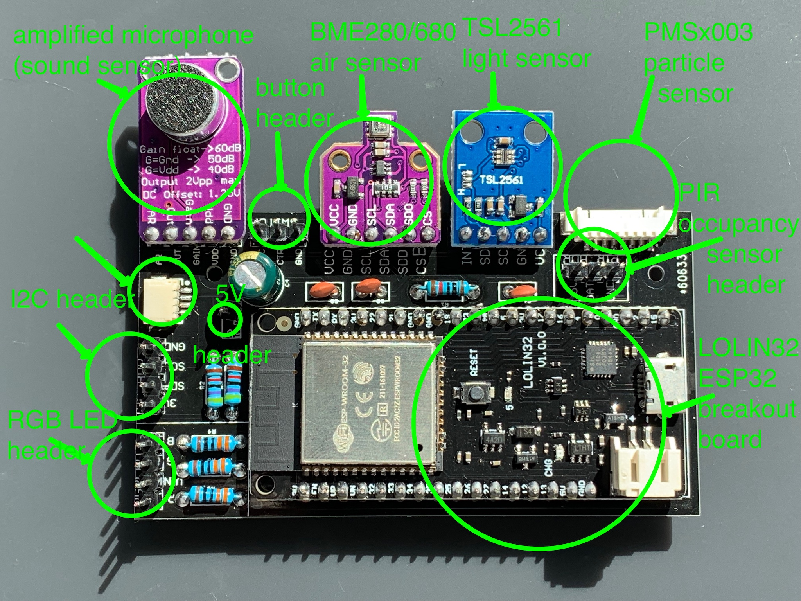
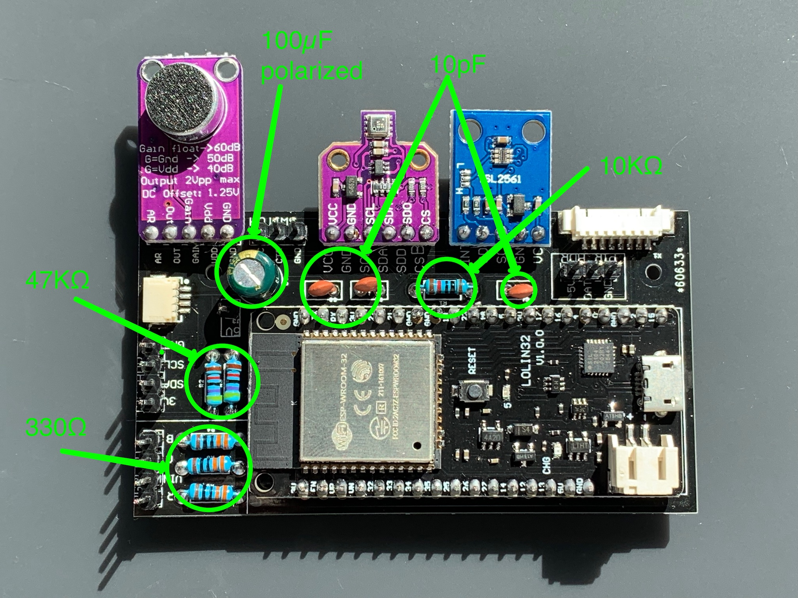

# Furball Hardware Guide

The Furball is based on an ESP32 processor.

The ESP32 supports IEEE802.11b/g/n wifi as well as Bluetooth 4.0 and BLE.

Furball uses I2C to communicate with a BME280 (air temperature, humidity and pressure) or BME680 (air temperature, humidity, pressure and volatile organics) and a TSL2561 (light intensity).

It also expresses the I2C bus via both a 4 pin header and a Sparkfun QUICC connector so that you can easily add external I2C devices if you want.

Furball also has a connector for a PMS5003 particle counter (via a 9600bps serial connection) and a PIR occupancy detector (via a digital input).

Furball can controll an RGB LED and can read the state of an switch (intended as a reset/factory reset button).

All of these are optional. Furball can detect the presence of a BME280, BME680, TSL2561 or external I2C device (external devices will need software support). It cannot detect whether a PIR sensor, RGB LED or switch is connected. The software also cannot currently detect whether a PMS5003 is connected but this may change with future releases.

## The printed circuit board

The Furball v4 board was designed using [Autodesk Eagle](https://www.autodesk.com/products/eagle/overview). The Eagle files are in the `eagle` directory of this repository. The board is small enough that the free version of Eagle works.

There are currently no known issues with the board but I cannot guarantee it will work 100% correctly and that no issues will be found in the future. *Use at your own risk*.

The board would benefit from better documentation on its silkscreen (resistors and capacitors are not well-labelled).

## Assembly

1. The PMS5003 and Sparkfun QUIIC connectors are both surface mount and for most people will be the most challenging part of assembling this board. They're both optional. If you're going to use them, I recommend soldering them first.  

  The technique I use is to apply solder to all the pads for both connectors using a fine tip on the soldering iron and fine solder (0.6mm).  

  Then I carefully, using my fingertips or needlenose pliers or tweezers, position the connector on top of the pads and use the soldering iron to melt one of the sides. I let that cool and then carefully melt each connection until the entire connector has solid contact with the board and solder.

2. I solder headers on the ESP32 breakout board as well as the other boards that I'm using in the project.

3. I solder the ESP32 breakout board onto the printed circuit board.

4. If I'm using it, I solder the TSL2561 onto the breakout board. Then I flash the board with the [ESP32 diagnostic](), run an I2C scan and confirm that the ESP32 can see the TSL2561. If it cannot I inspect the board for bad solder joints or shorts.

5. If I'm using it, I solder the BME280 or BME680 onto the board and run the ESP32 diagnostic and confirm that the ESP32 can see it and (if used) the TSL2561. Resolve any problems before proceeding.

6. Solder the microphone breakout board, if being used.

7. Next, solder the resistors and capacitors on the board.

- three 330 ohm resistors
- two 47K ohm resistors
- one 10k ohm resistor
- three 10pF capacitors
- one 100

This is a good time to run the diagnostic again in order to make sure the board still works.

8. Finally, solder whichever headers you want to use. You can ignore ones you don't need, and you can always add them later if you want.

- external I2C - 4 pins
- RGB LED - 4 pins
- PIR sensor - 3 pins
- switch - 3 pins
- 5V - 1 pin

9. Run the diagnostic a final time and resolve any problems.

10. Build and flasht the Furball firmware and watch its output to confirm that the board is working properly.
